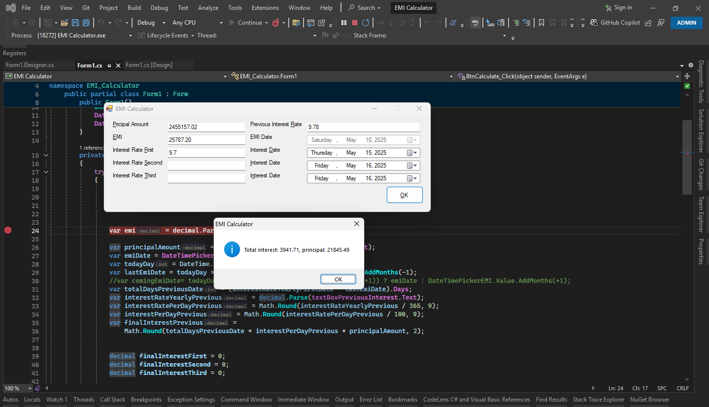

# EMI Calculator

## Description
This is an EMI (Equated Monthly Installment) calculator application that helps users calculate loan payments with variable interest rates. The calculator supports multiple interest rate periods and provides detailed breakdowns of principal and interest components.

## Features
- Calculates EMI based on principal amount and interest rates
- Supports up to three different interest rate periods
- Tracks payment dates and interest calculations
- Provides detailed breakdown of principal vs interest in each payment
- Handles decimal precision for accurate financial calculations

## Usage
1. Enter the principal loan amount
2. Input the applicable interest rates (up to three different rates for different periods)
3. The calculator will display:
   - Monthly EMI amount
   - Interest calculations for each period
   - Payment dates
   - Principal and interest components of each payment

## Technical Details
- The application uses precise decimal arithmetic for financial calculations
- Date handling for payment scheduling
- Supports variable interest rates that may change during loan tenure

## Installation
1. Clone the repository
2. Open the solution in Visual Studio
3. Build and run the application

## Dependencies
- .NET Framework
- Windows Forms (for the GUI version)

## Screenshot

## License
This project is open-source and available under the MIT License.

## Contributing
Contributions are welcome! Please fork the repository and submit pull requests.

## Support
For any issues or questions, please open an issue on the GitHub repository.